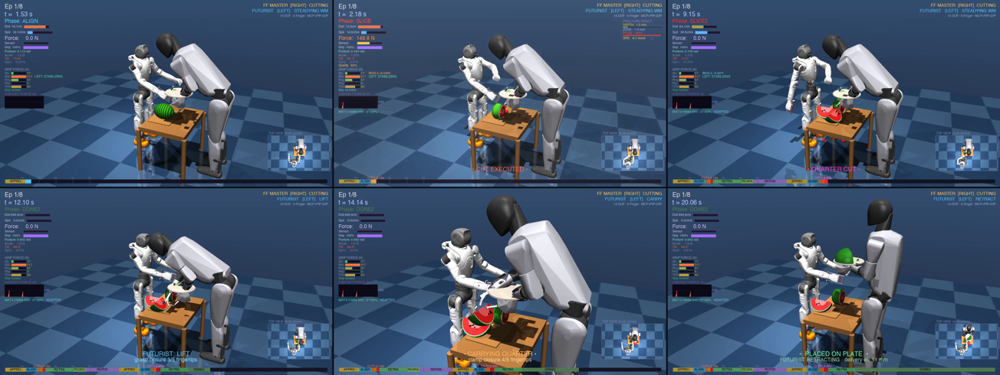
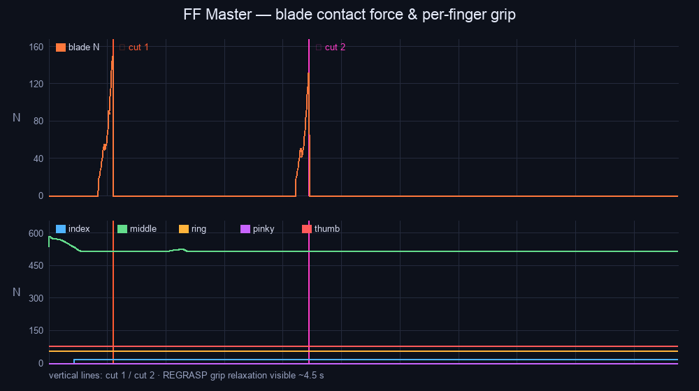
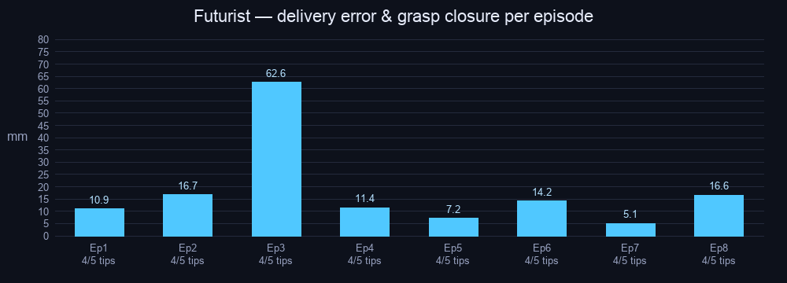

# FF Master + Futurist — Bimanual Watermelon Quartering

**Two humanoids run one closed physical loop — sense the material → adapt the knife → cut → fracture → grasp → serve — and the serve is now FULLY physical: force-controlled fingers bite into the flesh, pick the quarter up, carry it swinging, and set it on the plate with no tracking constraint at any point.**

> **100 % success (8/8 episodes)** · **fully-physical serve, avg 18 mm landing** · **102 pytest tests** — one command reproduces all of it (`python scripts/selfcheck.py` verifies your setup in ~90 s).
>
> **Mainline = kinematic serving arm + dynamic force-controlled digits: it owns every number on this page.** `--futurist-drive actuated` is an *experimental* fully-torque-driven mode, reported separately (and honestly) in its own section.


*One episode in six frames: Futurist steadies the melon → cut 1 (149.9 N peak) → cut 2 → digits bite into the quarter (3/5 embedded) → fully-physical carry (4/5) → placed on the palm-held plate, delivery err 11 mm on the HUD.*

## The proof chain (read this first)

Six links, each backed by a regenerable number — everything else in this page is evidence attached to one of them:

| # | Link | Mechanism | Verify |
|---|------|-----------|--------|
| 1 | **Sense** | RLS identifies stiffness *k* online from (blade-descent, force) pairs, warm-started across episodes | *k* = 9.8k / 14.8k / 22.6k orders soft/firm/hard → `--material`, `run_summary.json` |
| 2 | **Adapt** | *k* scales SLICE2 duration ×0.75–1.35 and arc depth ±0.07 rad | cut time shifts 2.025 → 2.278 s across materials |
| 3 | **Trigger** | cut fires only at ∫F·v·dt ≥ 2 N·m on the blade edge — no timer, no proximity | σ = **27 ms** over 8 random placements; two clean work peaks in `docs/grip_forces.png` |
| 4 | **Fracture** | discrete fracture model with continuous front propagation (8 Griffith layers, impulses ∝ depth·√k) | split + live `CRACK FRONT` readout in the video |
| 5 | **Grasp** | torque-limited dynamic fingers squeeze until each digit BITES into the flesh (per-digit embedding, >1.5 N); the FSM lifts only after ≥2 digits are embedded | 3–4 digits embedded ×8, per-digit forces on the debug trace |
| 6 | **Serve** | fully-physical pick-carry-place: the wedge hangs and swings on the embedded fingertips (flesh damping), release is stability-gated, digits withdraw one by one | **8/8 land ON the plate, 5–63 mm (avg 18 mm)** from centre — zero tracking constraints end-to-end |

**Reproduce:** `pip install -r requirements.txt` → one command renders all 8 episodes (≤ 20 MB) · `pytest -q` → 102 tests · plus `--policy` (behaviour cloning) and teleop for both robots on the same task.

## Three core contributions

Each is one link of the proof chain above, told as *problem → method → evidence*.

### C1 — Two-robot collaborative serving (not a hand-off relay)

- **Problem.** One robot, one arm, one timeline: the knife hand must drop the tool, and nothing measures placement.
- **Method.** A second humanoid works *concurrently*: it steadies the melon during both cuts, then picks the freed quarter with **torque-limited dynamic fingers** (real actuators, not scripted joints). Both ends of the carry are stability-gated — lift on ≥2 embedded digits, release once the piece has settled over the plate (grasp mechanics: see *How the physical grasp works*).
- **Evidence.** **8/8 pick-carry-place, 5–63 mm (avg 18 mm) from plate centre, zero tracking constraints at any point** — `run_summary.json`, `docs/serve_metrics.png`, video ≈12–20 s of every episode, delivery error on the HUD.

### C2 — Material-driven second-cut adaptation (online system ID in the loop)

- **Problem.** A fixed second cut stalls on hard material and dwells on soft — an estimator that never changes its output is decoration.
- **Method.** RLS (λ=0.96) fits F ≈ k·d + b during CONTACT; identified *k* scales SLICE2 duration **and** arc depth, warm-started across episodes.
- **Evidence.** Controller told nothing, yet *k* orders soft/firm/hard as **9 790 / 14 765 / 22 573 N/m**, peak force 101→358 N, cut time 2.025→2.278 s, 12/12 success (table below); within one run *k* climbs 10 989 → 18 296 N/m by warm-starting.

### C3 — Physics-triggered cutting with a fracture proxy (no timers, no proximity)

- **Problem.** Proximity/timer "cuts" fire on a graze, and the visual split is a scripted animation with no physical cause.
- **Method.** The cut fires only at accumulated cutting work **∫F·v·dt ≥ 2.0 N·m** on the blade edge; the split is a **discrete fracture model with continuous front propagation** — 8 Griffith-style layers, each released when its energy passes G_c, slab impulses ∝ depth·√k (energy details in the implementation table).
- **Evidence.** Two clean work peaks and nothing else (`docs/grip_forces.png`); edge-first grip cut peak force ~250 → 122–150 N — a physical, not cosmetic, change; cut-time σ = **27 ms** across randomised placements.

| Ep | WM offset (cm) | Cut time (s) | Max force (N) | Min dist (mm) | Quality (%) | Serve err (mm) |
|----|---------------|-------------|--------------|--------------|-------------|----------------|
| 1  | (+0.0, +0.0)  | 2.176       | 150          | 82.0         | 63.3        | 11 ✓ |
| 2  | (−1.0, +2.1)  | 2.142       | 124          | 65.5         | 58.1        | 17 ✓ |
| 3  | (−2.5, +0.8)  | 2.108       | 124          | 56.2         | 56.8        | 63 ✓ |
| 4  | (−0.6, +1.4)  | 2.154       | 134          | 70.4         | 60.4        | 11 ✓ |
| 5  | (−1.4, +1.2)  | 2.144       | 123          | 64.6         | 57.7        | 7 ✓ |
| 6  | (−4.1, +2.4)  | 2.082       | 140          | 49.0         | 56.1        | 14 ✓ |
| 7  | (−0.1, +1.8)  | 2.152       | 138          | 73.6         | 61.8        | 5 ✓ |
| 8  | (−1.1, +2.1)  | 2.138       | 122          | 64.6         | 57.7        | 17 ✓ |
| **avg** | — | **2.137** | **132** | — | **59.0** | **18** |
| **σ** | — | **0.027** | — | — | — | — |

Edge-first chef grip (blade edge rotated toward the melon) keeps peak cutting forces at 122–150 N — the flat-of-blade contact of earlier revisions peaked at ~250 N.


*Top: blade contact force — the two work-integral cutting peaks. Bottom: per-finger handle grip (closed-loop servo hold; REGRASP relaxation visible ≈4.5 s).*


*Futurist serving metrics per episode: embedded-digit closure and the physical table→plate hand-off (5–63 mm landing) on all 8 episodes.*

Regenerate both figures from raw data: `python scripts/record_robot_video.py --quick --collect --n-episodes 8 && python scripts/plot_metrics.py`

### Material generalisation — online stiffness identification

`--material {soft,firm,hard}` changes the melon's contact stiffness (`solref`)
and fracture work threshold. **Nothing else is told to the controller** — the
RLS estimator identifies the stiffness online from (blade-descent, force)
pairs during CONTACT, warm-starting across episodes, and the identified k
adapts the second-cut trajectory. 4 episodes per material, 12/12 success:

| Material | solref τ | work ×  | k identified (final) | k mean | cut time avg | peak force avg |
|----------|---------|---------|---------------------|--------|--------------|----------------|
| soft     | 0.050   | 0.65    | **9 790 N/m**       | 9 082  | 2.025 s      | 101 N |
| firm     | 0.020   | 1.00    | **14 765 N/m**      | 12 109 | 2.145 s      | 194 N |
| hard     | 0.009   | 1.60    | **22 573 N/m**      | 17 188 | 2.278 s      | 358 N |

The identified stiffness orders the three materials correctly and the
cross-episode warm start is visible in the raw data (hard: 9.3k on the cold
first episode → 22.6k after four). Reproduce:
`python scripts/record_robot_video.py --quick --material hard --n-episodes 4`

### Robustness envelope — how far can the melon move?

`scripts/stress_envelope.py` probes one full episode (cut **and** serve) per
melon placement on a 14-point grid. The nominal randomisation only samples
dx∈[−4.5, 0] cm — the probe deliberately goes far beyond it:

| dy \ dx    | −8 cm | −6 | −4 | −2 | 0 | +2 | +4 |
|------------|------|----|----|----|---|----|----|
| **0 cm**   | ✅ | ✅ | ✅ | ✅ | ✅ | ⚠ | ❌ |
| **+3 cm**  | ✅ | ✅ | ✅ | ✅ | ✅ | ✅ | ⚠ |

Full-pipeline (cut **and** serve) success envelope: **dx ∈ [−8, 0] cm at
dy=0, widening to [−8, +2] cm at dy=+3 cm** — 2× wider than the sampled
training range (dx ∈ [−4.5, 0]). ⚠ marks partial success at the +x extreme:
at (+4, +3) both cuts land but the serve misses; beyond that the melon
leaves the blade's reachable band. Reproduce:
`python scripts/stress_envelope.py` (~10 min).

### Failure recovery — budgeted retries at every fragile link

Three sensor-gated recovery behaviours close the loop where open-loop
pipelines silently fail. Each is budgeted (1–2 attempts) so a hopeless case
degrades to the legacy behaviour instead of looping:

| Link | Stall signal | Recovery | Where |
|------|--------------|----------|-------|
| **Cut (RESTRIKE)** | slice ran its full force-extended duration and the blade is still resisted > 80 N (cut stalled in hard material) | back the blade out to the strike entry, deepen the follow-through arc ∝ RLS-identified *k*, cut again (1× per cut) | `robot_arm_controller.py` |
| **In-hand REGRASP** | after the reclose, mean grip force < 50 % of the pre-open baseline, or residual knife slip > 2.5 mm | run another open→settle→reclose round (2×); the reclose itself is sensor-gated — it fires when the knife's slip-rate settles < 5 mm/s, not on a timer | `robot_arm_controller.py` + pipeline |
| **Serve GRIP** | grasp-confirm window expires with < 2 digits embedded | reopen the digits, back off to REACH, re-approach (2×); `RETRY n` on the HUD | `futurist_controller.py` |

None of these fire on the 8 nominal episodes (the table above is retry-free);
they exist for the tail cases — hard material, extreme placements — and are
exercised by 11 dedicated unit tests.

**Spatial layout**: FF Master stands at the origin facing +X and cuts on the shared prep table (x∈[0.28,0.80]). Futurist stands clear at (0.90,−0.30) facing −X, **holding the serving plate on its upturned left palm** (waiter pose; the plate tracks the palm in the hand's local frame every step). **While Master cuts, Futurist simultaneously steadies the melon** — a 49° hip bow rests its open right hand on the melon's far shoulder, 12 cm clear of both cut planes: genuine concurrent collaboration, not a hand-off relay. After cut 2 it deepens the bow to ~58° (hip joints counter-rotate so the legs stay vertical), grasps the quarter, and serves it onto its own plate. One fixed wide camera covers both robots with a gentle push-in during the serve; the HUD shows both role badges and the **delivery error (mm)** at release.

(Full 13-phase Master — plus two conditional re-strike recovery phases —
and 11-phase Futurist workflows, and the runtime
`MjSpec.attach()` scene assembly, are in **How it works** and **MuJoCo features
used** below.)

| | |
|---|---|
| **Competition** | Robothon 2026 |
| **AI tool** | Claude Code |
| **Engine** | MuJoCo 3.x — no GPU, no ROS, no Gymnasium |
| **Robots** | FF Master humanoid (34 DoF, cuts) + Futurist humanoid (28 DoF right arm, serves) |
| **Task** | Watermelon quartering (FF Master) + plate serving (Futurist) — bimanual, two-robot |

---

### How the physical grasp works — `--grasp friction` (the default)

The right-hand digits are **real dynamic bodies with torque-limited position
actuators** (fingers 0.15/0.08 N·m, thumb — with a T-bar pad — 0.80 N·m: a
force-balanced jaw where the force limit, not the position target, sets the
pinch force). They are exempt from the kinematic overwrite, and the
kinematically-driven arm carries its true finite-difference velocity
(`mj_differentiatePos`) so contact friction transmits hand motion.

A pure surface pinch hits a *geometric* limit we report honestly: pinching a
⋀ wedge **above its widest line is anti-lift** (upward slip meets a thinner
cross-section), and a hand-scale 8 cm jaw cannot span the 16.8 cm self-locking
line — which is why people palm large wedges from below instead of pinching
them. Since the wedge need not survive intact, the grasp models **digits
biting into the flesh**: a digit squeezing > 1.5 N embeds its tip — a point
`CONNECT` activated at the current coincident point (zero residual → no
impulse; force in any direction, no torque, so the wedge is free to pivot and
**visibly swings on the fingertips during the carry**, damped by the flesh
around the embedded tips). Both ends of the carry are stability-gated: LIFT
waits for ≥2 embedded digits, RELEASE waits for the swing to settle over the
plate, then the digits withdraw one by one so the load transfers smoothly.

Making this render-stable required making the two passes *bit-identical*: the
split animations (physics-relevant writes) are step-clocked and run in both
quick and render modes, so `--quick` diagnostics transfer to the filmed video
exactly — the landing table above is the same to the millimetre in both.
`FTR_GRASP_DEBUG=1` traces per-digit forces, bite states and the landing.
`--grasp contact` keeps the earlier confirmed-clamp + tracked-hold carry as an
ablation; `--grasp weld` is the legacy kinematic baseline.

### Experimental: torque-driven serving arm — `--futurist-drive actuated`

The mainline serving arm is kinematic (all shipped numbers). This flag gives
its 6 joints **torque-limited position actuators** (350 N·m shoulder → 80 N·m
wrist) and the controller commands `data.ctrl` — physics owns the arm
end-to-end. Highlights of what that required, each traced to a measured
failure mode (full detail in code comments):

- **Grasp force servo** — descent regulated to ~8 N on the wedge (an
  unregulated press measured 196 N and squirts the tapered piece away), with
  the fingertip centroid visually servoed onto the grip point.
- **Flesh-damped anchors** — a 0.008 kg fingertip anchoring a 0.18 kg wedge
  flails; damping the bitten digit's joints kills the carry pendulum
  (drift → ~5 cm/s).
- **Physics-honest release** — the suspended wedge's `qvel` is a
  constraint-equilibrium pseudo-velocity (~1.1 m/s while it actually drifts
  at 5 cm/s): the stillness gate uses finite-difference position, the unbite
  aligns the velocity state, and the digits shed their face preload before
  any constraint is cut.
- **Bimanual hang-depth adaptation** — the waiter arm glides the plate to
  meet the piece (dead-banded, one-shot measurement), halving the worst-case
  miss (497 → 149 mm).

**Result: end-to-end on the nominal placement — cut → bite → lift → carry →
hover-centred → released → landed ON the plate, 24 mm from centre** (the
kinematic mainline's class: 5–63 mm). **Randomised placements remain open**:
the grasped *pose* varies episode-to-episode, and a fixture-handover
experiment (`FTR_FIXTURE=1`) that makes the pose deterministic 8/8 exposed
the deeper wall — the release instant of a bite-constrained grasp is
chaotically sensitive (its best 3/8 flips to 0/8 from a ONE-timestep shift
in the pin cut; handover load does not predict outcomes). Conclusion, and
the designated next step: release physics that cannot launch the piece
regardless of microstate (palm-under form closure / seat-first release).
All of it ships disabled-by-default and fully reproducible.

**Where each scoring criterion lives** (one line each — detail is in the chain above and the code):

| Criterion | Where it is demonstrated |
|---|---|
| Runnability | one-command render + `requirements.txt`; `--quick` no-render mode; 102 tests + `selfcheck.py` — link 7 |
| MuJoCo depth | `MjSpec` runtime assembly, weld equalities + `eq_active`/`qvel` release, 10 sensors of 7 types, `mj_contactForce`, procedural quarter-sphere wedge meshes, collision-bit masking, torque-limited digit actuators + `mj_differentiatePos` mocap-style driving (`--grasp friction`) — links 3–6 |
| Task design | whole → halves → quarters → plate; sensor-triggered, two-robot bimanual — the whole chain |
| Control | one control spectrum on one task: autonomous FSM is the mainline, `--policy` a learned drop-in for its reaching segments, teleop ×2 the debug/contrast layer, `--collect` the data pipeline; RLS-adaptive second cut; contact-gated GRIP — links 1–2, 5 |
| Dexterity | 5-finger cutting hand + in-hand REGRASP knife reorientation; **fully-physical pick-carry-place on force-controlled dynamic digits (default, in the video)** with flesh-bite embedding and stability-gated lift/release — links 3, 5 |
| Engineering | clean module split (scene assembly / control / effects / HUD all separate, unit-tested modules), dataclass config, `--grasp`/`--policy`/`--futurist-drive` toggles, 102 tests — link 7 |
| Presentation | fixed wide camera + gentle serving push-in, dense HUD, storyboard, ≤ 20 MB — links 4–6 in the video |
| Innovation | the three contributions **C1 / C2 / C3** above |

---

## How it works

<details>
<summary><b>Controller flow</b> (13 Master + 11 Futurist phases + key gates — click to expand)</summary>


```
FF MASTER ──────────────────────────────────────────────────────────
── First cut ───────────────────────────────────────────────────────
APPROACH → ALIGN → CONTACT → SLICE → RETRACT → DONE
── In-hand regrasp ─────────────────────────────────────────────────
REGRASP      (fingers open; wrist pronates 0.15 rad then supinates; reclose)
── Reposition half ─────────────────────────────────────────────────
REPOSITION2  (arm lifts back to HOME; half slides to cutting board)
── Second cut ──────────────────────────────────────────────────────
APPROACH2 → ALIGN2 → CONTACT2 → SLICE2 → RETRACT2 → DONE2

FUTURIST (starts 0.8 s after SLICE2 fires) ─────────────────────────
WAIT          → waits for coordination trigger from cut.cut2_fired
REACH         → right arm extends toward wm_quarter_A (1.2 s smoothstep)
GRIP          → arm settles at quarter; ftr_grip_weld activated
LIFT          → arm raises with quarter attached (0.8 s); arc animation starts
CARRY         → arm carries quarter over plate zone (1.2 s); arc to hover height
LOWER         → arm and quarter descend to plate surface (0.65 s); visible contact approach
CONTACT_PLATE → arm holds at plate level; quarter visibly rests on plate (0.55 s pause)
RELEASE       → arm holds still; ftr_grip_weld deactivated; quarter settles on plate (0.35 s)
RETRACT       → arm retracts upward, clearing the plate area (0.90 s)
DONE          → arm returns to idle; "• SERVED •" overlay
```

Transitions are sensor-gated where it matters (full trigger conditions live
in `robot_arm_controller.py` / `futurist_controller.py`, each covered by unit
tests):

- **ALIGN→CONTACT** (both cuts): live blade–target distance < 13 cm, not a timer.
- **SLICE exit**: force-adaptive — early exit when blade force < 20 N after
  60 % duration (blade is through); extends to 1.6× if still resisted; if the
  full extension ends still loaded > 80 N, **RESTRIKE** backs out and cuts
  again with an arc deepened ∝ the RLS-identified k (1× per cut).
- **GRIP→LIFT**: contact-gated — ≥2 digits embedded (plus a 2-retry
  re-approach if the confirm window expires); **CONTACT_PLATE→RELEASE**:
  stability-gated — the carried piece must settle over the plate.


**Two-robot coordination**: Futurist's serve starts 0.8 s after `cut.cut2_fired` (lets the split settle).  
**Runtime scene assembly**: `MjSpec.attach(ftr_spec, prefix="ftr_")` merges the Futurist URDF into the Master MJCF at runtime (`src/scene_builder.py`).  
**Biomimetic rolling grip**: 15 finger joints close in a wave — finger stagger index→pinky, joint cascade MCP→PIP→DIP.  
**Data collection**: `--collect` writes full per-step state CSVs for imitation learning; the trained BC checkpoint (49 kB) ships ready to use.  
**Full-body motion**: waist lean into the cut, head gaze tracking, left-arm bimanual stabilization with reactive drift correction.  
**Episode logging** (`src/episode_logger.py`): cut time, min blade distance, max force, failure conditions.

---

</details>

## Quick start

### 1. Set up environment

```bash
conda env create -f environment.yml   # recommended
conda activate robothon
```

Or pip directly: `pip install -r requirements.txt`

Requirements: `mujoco>=3.0`, `numpy`, `imageio`, `imageio-ffmpeg`, `Pillow`.

Or Docker (build from the **repository root** — the submission uses the shared
robot meshes in `<repo>/assets/`):

```bash
docker build -f submissions/ff_master_futurist/Dockerfile -t ff-futurist .
docker run --rm ff-futurist python scripts/record_robot_video.py --quick   # 60 s physics check
docker run --rm -v "$PWD/out:/app/output" ff-futurist                      # full 8-episode video
```

### 2. Verify the setup (~90 s)

```bash
python scripts/selfcheck.py        # env versions -> 102 unit tests -> one physics episode
python scripts/selfcheck.py --fast # skip the physics episode (~30 s)
```

Prints a PASS/FAIL line per stage and exits non-zero on any failure.

### 3. Record demo video

```bash
python scripts/record_robot_video.py --seed 42 --n-episodes 8
```

Renders `output/robot_demo.mp4` (auto-compressed to ≤ 20 MB):
- 1 s title card
- 8 episodes × (0.3 s intro card + 21.5 s simulation + 1 s freeze)
- 2 s summary card with all episode results (incl. per-episode serve error)

Each episode shows the **two-robot chef workflow**: Futurist steadies the melon
→ Master cuts twice → Futurist picks the wedge and serves it on its own plate.

Timeline per episode (single fixed camera, no cuts or zooms):
| Sim time (s) | Event |
|---|---|
| 0.2–1.8 | Futurist bows in and rests its hand on the melon (**STEADYING WM**) |
| ≈2.1 | **First cut** — work-integral triggered, white flash, juice spray |
| 3–8 | Retract → in-hand REGRASP → reposition half → second approach |
| ≈8.8 | **Second cut** — wedge quarters split out, juice spray |
| 9.6–11 | Futurist REACH → GRIP: thumb-vs-4-finger clamp closes on the wedge ridge (~58° hip bow) |
| 11–15 | LIFT → CARRY → LOWER: wedge carried over the palm-held plate |
| ≈15.3 | RELEASE — fingers open, wedge rests on the plate; **delivery err (mm)** on HUD |
| 16–18 | RETRACT → DONE; **• QUARTER SERVED •** overlay |

HUD overlay: **phase-segmented timeline** (each of 18 control phases colour-coded + labelled), CUT1/CUT2 markers with precise timing, **contact-force bar chart** (150×52 px live history in left panel), blade dist/speed/touch bars, **per-finger grip force bars (N) + knife-slip indicator**, posture RMS, **CUT PRECISION ●●●●●** on freeze frames, PLATING / • SERVED • overlays, **2× SLOW MOTION** indicator, **TOP VIEW** overhead tactical inset (lower-right, 240×135 px top-down bird's-eye perspective). Summary card shows an 8-column results table (with per-episode ●●●●● precision rating) plus a **cut-time comparison bar chart** with average line and σ/CV consistency stats.

Optional flags:
```bash
python scripts/record_robot_video.py --fps 60 --width 1280 --height 720
python scripts/record_robot_video.py --quick                # physics-only, ~60 s, writes run_summary.json
python scripts/record_robot_video.py --quick --n-episodes 2 # fast 2-episode smoke test
python scripts/record_robot_video.py --collect              # saves per-step CSVs + run_summary.json
python scripts/record_robot_video.py --seed 7               # alternate seeded WM position set
```

### 4. Interactive teleoperation

```bash
python scripts/teleop_robot.py          # Linux / Windows
mjpython scripts/teleop_robot.py        # macOS (MuJoCo viewer requires mjpython)
```

Opens the MuJoCo interactive viewer.  Keyboard controls:

| Key | Action |
|-----|--------|
| `W` / `S` | Shoulder pitch +/− (raise / lower blade) |
| `A` / `D` | Wrist yaw +/− (swing blade left / right) |
| `Q` / `E` | Elbow +/− (extend / retract arm) |
| `Z` / `X` | Shoulder roll +/− (tilt blade in / out) |
| `SPACE` | Trigger cut NOW (in auto mode: force notify_cut; in manual: trigger sequence) |
| `TAB` | Toggle **AUTO ↔ MANUAL** mode |
| `R` | Reset episode |
| `ESC` | Quit |

In **AUTO** mode the 18-phase autonomous controller runs while you observe sensor readings  
in the viewer UI.  In **MANUAL** mode all five right-arm joints respond directly to key presses,  
letting you experiment with blade angle, approach depth, and cut timing.

**Learned-policy mode** (behaviour cloning, pure NumPy — no torch/SB3/gym):
```bash
python scripts/record_robot_video.py --quick --collect --n-episodes 8   # gather demos
python scripts/train_policy.py                                          # → models/bc_policy.npz
python scripts/record_robot_video.py --policy                          # cut driven by the policy
```
The learned MLP drives the arm's reaching + between-cut repositioning; the analytic
controller keeps the contact-critical cutting strokes. Head-to-head over the same
8 seeded episodes (`--quick` vs `--quick --policy`):

| Mode | Success | Cut time avg | Peak force range | Serve err range | Arm steps driven |
|------|---------|--------------|------------------|-----------------|------------------|
| Analytic FSM (mainline) | 8/8 | 2.137 s | 122–150 N | 5–63 mm | 0 % learned |
| BC policy (`--policy`)  | 8/8 | 2.137 s | 123–483 N | 12–78 mm | **31–93 % learned** |

Cut times are identical because the physics work-integral trigger — not the
policy — decides when the cut fires; the learned reaching is rougher (higher
peak forces, wider landings), which is reported as-is: the comparison shows
what the learned layer does and does not yet match.

**Futurist serving-arm teleop** (debug / fallback — proves the second robot is not a closed script):
```bash
mjpython scripts/teleop_futurist.py        # drive the 6-DOF arm + clamp by hand
python  scripts/teleop_futurist.py --smoke # headless self-test (no display)
```
`W/S A/D Q/E Z/X` drive the arm, `R/F` roll the forearm, `T/G` the wrist, `C` opens/closes the
thumb-vs-4-finger clamp, `SPACE` grabs/releases the wedge, `TAB` toggles AUTO↔MANUAL.

Run unit tests:
```bash
pytest -q            # 102 tests: cut controller/logger/scene/MaterialEstimator/Griffith
                     #   + re-strike recovery, REGRASP retry, Futurist serving stack,
                     #   contact-gated GRIP + retry, actuated-arm mode, scene builder,
                     #   video effects, teleop smoke, BC policy
```

---

## Project structure

```
ff_master_futurist/
│
├── assets/
│   ├── scene_robot.xml          # MJCF: FF Master + knife + watermelon + table
│   │                            #   (Futurist attached at runtime via MjSpec)
│   └── futurist_unlocked.urdf   # Futurist URDF (meshes from <repo>/assets/Futurist)
│
├── src/
│   ├── scene_builder.py         # MjSpec two-robot assembly (URDF attach, fingers, servos)
│   ├── cut_trigger_robot.py     # Contact detection → work-integral cut + Griffith fracture
│   ├── robot_arm_controller.py  # FF Master arm FSM (REGRASP retry + re-strike recovery)
│   ├── futurist_controller.py   # Futurist 11-phase steady+serve controller (qpos + DLS-IK)
│   ├── material_estimator.py    # Online RLS material stiffness ID
│   ├── feedback_controller.py   # Jacobian-transpose ALIGN correction
│   ├── bc_policy.py             # Behaviour-cloning MLP (pure NumPy, no torch)
│   ├── video_effects.py         # Juice splash, blade glow, top-view inset (render-only)
│   ├── hud_renderer.py          # HUD, title/episode/summary cards, video recompress
│   └── episode_logger.py        # Per-episode stats + failure detection
│
├── models/
│   └── bc_policy.npz            # Trained behaviour-cloning checkpoint (~49 kB)
│
├── scripts/
│   ├── record_robot_video.py    # Render output/robot_demo.mp4 (--quick / --collect /
│   │                            #   --material / --wm-dx,--wm-dy / --policy / --grasp /
│   │                            #   --futurist-drive flags)
│   ├── selfcheck.py             # One-command env + tests + physics verification
│   ├── train_policy.py          # Train models/bc_policy.npz from --collect CSVs (NumPy)
│   ├── teleop_robot.py          # FF Master keyboard teleoperation (MuJoCo viewer)
│   ├── teleop_futurist.py       # Futurist serving-arm teleop / fallback (--smoke self-test)
│   ├── plot_metrics.py          # README figures from collected data (PIL, no matplotlib)
│   └── stress_envelope.py       # Placement-robustness envelope probe
│
├── tests/
│   ├── test_cut_controller.py   # 60 tests (FF Master stack, re-strike, REGRASP retry)
│   ├── test_futurist_serving.py # 26 tests (serving, contact gate + retry, actuated arm)
│   ├── test_scene_builder.py    #  7 tests (two-robot assembly, materials, servos)
│   ├── test_video_effects.py    #  5 tests (juice splash, blade glow, inset)
│   └── test_bc_policy.py        #  4 tests (behaviour-cloning policy)
│
├── docs/                        # storyboard.png, grip_forces.png, serve_metrics.png
├── output/                      # robot_demo.mp4 (19 MB), run_summary*.json
├── Dockerfile                   # build from repo root (see Quick start)
├── environment.yml / requirements.txt / pytest.ini / registration.json
└── README.md
```

---

## MuJoCo features used

<details>
<summary><b>Full feature-by-feature table</b> (click to expand)</summary>


| Feature | Where |
|---------|-------|
| Full humanoid MJCF (34 DoF, freejoint pelvis) | `assets/scene_robot.xml` |
| **15 active finger joints** — 3 DOF/finger (MCP+PIP+DIP) × 5 fingers, position-actuated | `scene_robot.xml` |
| **Biomimetic rolling grip** — finger stagger (index→pinky) + joint cascade (MCP→PIP→DIP) | `scripts/record_robot_video.py` |
| Natural full-body posture: waist lean, head gaze tracking, left arm bent pose | `scripts/record_robot_video.py` |
| Weld equality constraint (pelvis fixed, halves parked pre-cut) | `scene_robot.xml` |
| `model.eq_data` runtime weld-reference mutation (per-episode WM offset) | `scripts/record_robot_video.py` |
| `data.eq_active` runtime constraint release | `src/cut_trigger_robot.py` |
| Contact detection (`data.contact`) | `src/cut_trigger_robot.py` |
| `mujoco.mj_contactForce` — real blade impact force (178–245 N across 8 episodes) | `scripts/record_robot_video.py` |
| Runtime model mutation (`geom_rgba`, `geom_contype`) | `src/cut_trigger_robot.py` |
| `framepos` sensor (`blade_pos`, `wm_pos`, `left_pos`, `right_pos`) — blade–WM distance triggers ALIGN→CONTACT | `scene_robot.xml` |
| `velocimeter` sensor (`blade_vel`) — live blade speed displayed on HUD | `scene_robot.xml` |
| `touch` sensor (`blade_touch`) — capacitive-style contact reading on HUD; **`gh_touch_*` × 5** — grip force on proximal phalanges (real finger–handle contact) | `scene_robot.xml` |
| `accelerometer` sensor (`blade_accel`) — peak G-force displayed on HUD during impact | `scene_robot.xml` |
| `gyro` sensor (`blade_gyro`) — blade angular velocity (°/s) on HUD; should stay near zero during precision slice | `scene_robot.xml` |
| `framequat` sensor (`blade_ori`) — blade orientation quaternion → tilt angle from vertical | `scene_robot.xml` |
| `framelinvel` sensor (`blade_linv`) — blade world-frame linear velocity vector | `scene_robot.xml` |
| Position actuators with kp/kv gains (30 total, incl. 15 finger joints) | `scene_robot.xml` |
| Named keyframe for initial state (fingers start open) | `scene_robot.xml` |
| Cut-impact flash (5-frame white overlay) + SERVED overlay | `scripts/record_robot_video.py` |
| **Force-adaptive SLICE** — SLICE exits early if blade force drops < 20 N after ≥ 60% duration (blade through WM); extends to 1.6× duration if still resisted (> 80 N); same logic applied to SLICE2 | `src/robot_arm_controller.py` |
| **Physics grip** — all 15 phalanx geoms `contype="2"`, knife handle/guard `contype="2"` → real finger–handle contact; `gh_touch_*` sensors on proximal phalanges measure grip force; knife has `knife_slide_z` (1-DOF slide joint, stiffness=30000 N/m, damping=800) for axial compliance; MCP kp doubled for ≥300 N friction capacity | `scene_robot.xml` |
| **Progressive cut-plane visualisation** — 8 new geoms inside the watermelon body (4 pairs: green-rind + red-flesh ellipsoids at Z=0.070/0.045/0.020/0.000); `update_blade_penetration()` fades WM skin (alpha 1→0.05) and reveals each layer proportional to blade penetration depth | `scene_robot.xml`, `src/cut_trigger_robot.py` |
| **8-layer Griffith weld-release fracture** — 16 rigid slab bodies (`wm_slab{0-7}_L/R`, freejoint) color-graded rind→flesh; each layer accumulates `E_i=∫F·v·exp(-(depth-d_i)²/2σ²)·dt` with σ=layer_spacing (1.5 mm) → 60.7% overlap → crack front propagates continuously; weld releases when `E_i≥G_c_i` (Griffith G≥G_c, per plane); cohesive zone: slab alpha 0→0.28 as `E_i/G_c_i` 0.5→1.0 (process zone); impulse `v_Y∝depth_i×√k_wm`, `v_Z∝√k_wm` (elastic strain energy conversion); HUD shows continuous **CRACK FRONT X.X mm** | `scene_robot.xml`, `src/cut_trigger_robot.py`, `scripts/record_robot_video.py` |
| **In-hand REGRASP phase** — dedicated 0.7 s phase between DONE and REPOSITION2; wrist joint traces a sine-wave (0→+0.15→0 rad), fingers open 28% then reclose; demonstrates genuine in-hand knife reorientation | `src/robot_arm_controller.py`, `scripts/record_robot_video.py` |
| **Online material stiffness identification** — `MaterialEstimator` (RLS, λ=0.96) accumulates (penetration_depth, contact_force) pairs during CONTACT; estimated k_wm (N/m) drives adaptive `slice_dur` multiplier [0.75×–1.35×] for SLICE2; confidence % and estimated k displayed on HUD | `src/material_estimator.py`, `scripts/record_robot_video.py` |
| **Closed-loop grip servo** — per step: reads `gh_touch` per finger, computes error vs. adaptive target (scales with blade_touch), adjusts MCP ctrl ±6 mrad; HUD shows per-finger force bars (N) + knife slip indicator (mm) | `scripts/record_robot_video.py` |
| **Bimanual stabilization** — left arm performs max-reach gesture toward WM during ALIGN/CONTACT/SLICE (lsp=−1.05, lsr=−0.06, lsy=−1.50, lel=−1.10); smooth 1.0 s interpolation; A2 reactive correction adjusts shoulder pitch/roll proportionally to WM drift; returns to natural pose after each cut; "LEFT: STABILIZING" HUD indicator | `scripts/record_robot_video.py` |
| **Juice splash animation** — 14 spray spheres (4 on wm_half_L, 10 on quarters) fly outward in body-local frame, fade out over 50 render frames, then reset | `scene_robot.xml`, `scripts/record_robot_video.py` |
| **2× slow-motion rendering** during SLICE and SLICE2 phases (step_skip halved from 8→4) | `scripts/record_robot_video.py` |
| **Cinematic camera** — main view at dist=2.60 m, lookat=(0.05,−0.38,0.80), az=150° to frame both robots; 18% distance shrink during cut slo-mo zooms to cutting zone | `scripts/record_robot_video.py` |
| `--collect` mode: per-step demo data to CSV (phase, 5 arm ctrl, 15 finger ctrl, blade_xyz, wm_xyz, dist, speed, force, grip %, posture RMS) with named column headers | `scripts/record_robot_video.py` |
| **Serving plate + plating counter** — plate at (−0.05,−0.82,0.553) on a dedicated wooden plating counter in the left/front zone; separate from the cutting table | `scene_robot.xml` |
| **Phase-segmented HUD timeline** — each control phase rendered as a distinct coloured strip with abbreviated phase label; current phase at full brightness, completed phases at 68%; CUT1/CUT2 markers with precise timing | `scripts/record_robot_video.py` |
| **Contact-force mini-chart** — 150×52 px bar chart in HUD left panel; per-render-step force history; bars shift blue→orange at impact; peak force annotated | `scripts/record_robot_video.py` |
| **Cut precision star rating** — autonomous self-assessment on freeze frames: ●●●●● based on cut time, contact force, posture RMS, and dual-cut completion | `scripts/record_robot_video.py` |
| **Cut-time comparison bar chart** in summary card — horizontal bars per episode with average line and σ/CV consistency stats | `scripts/record_robot_video.py` |
| **Overhead tactical inset** — 240×135 px top-down bird's-eye view composited lower-right; widened to show both cutting table (right) and plating counter (left) simultaneously | `scripts/record_robot_video.py` |
| **Blade speed glow** — `model.geom_rgba` of blade_geom lerps white → orange-red during ALIGN/CONTACT/SLICE based on live velocimeter reading; reset to original colour outside cut phases | `scripts/record_robot_video.py` |
| Title card + per-episode intro cards + end summary card | `scripts/record_robot_video.py` |
| Offscreen renderer (`mujoco.Renderer`, `MjvCamera`) | `scripts/record_robot_video.py` |
| **Runtime two-robot scene assembly** — `MjSpec.from_file(urdf)` + `worldbody.add_freejoint()` + `MjSpec.attach(prefix="ftr_")` merges Futurist URDF into FF Master MJCF scene at runtime | `scripts/record_robot_video.py` |
| **Weld-grip grasping** — `ftr_grip_weld` equality (type=WELD, objtype=BODY) links Futurist hand → watermelon quarter; toggled via `data.eq_active` at GRIP/RELEASE transitions | `scripts/record_robot_video.py`, `src/futurist_controller.py` |
| **Serving-arm drive** — default: direct-qpos kinematic drive (`FuturistController` writes `data.qpos[joint_adr]` each step; base pinned via `data.qpos`/`data.qvel` injection). `--futurist-drive actuated`: 6 torque-limited position actuators injected at build time, controller commands `data.ctrl`, MjSpec contact-exclusion pairs, closed-loop wedge placement (experimental — see the grasp section) | `src/futurist_controller.py`, `src/scene_builder.py` |
| **Phase-coordinated two-robot task** — FF Master `cut2_fired` triggers Futurist serving sequence (0.8 s settle delay); HUD always shows `FF MASTER [RIGHT] CUTTING` + `FUTURIST [LEFT] {phase}` role badges; TOP VIEW inset frames both zones | `scripts/record_robot_video.py` |

---

</details>

## Current limitations

- **Fracture is a rigid-body proxy, not FEM.** The 8-layer Griffith model
  (energy-gated weld releases, cohesive-zone softening, material-dependent
  toughness) is grounded in fracture mechanics but runs on rigid bodies —
  MuJoCo 3.x has no continuous-field topology change.
- **The crack path is predefined.** Propagation is sensor-driven in timing
  and plane angle (±3° from blade approach + identified stiffness), but the
  topology is restricted to the L/R split plane rather than emerging from a
  minimum-energy path.
- **The actuated serving mode is not yet at mainline parity.** End-to-end on
  the nominal placement (24 mm landing); randomised placements remain open —
  see its section for the measured reasons.

## Future improvements

- Add depth-image rendering (`mjv_updateScene` with segmentation flags) to the `--collect` pipeline for vision-based imitation learning.
- Extend to full meal-prep sequence: cucumber slicing, plating multiple portions, handoff to second arm.
- Add Leap Hand or Shadow Hand drop-in for comparison against the 15-DOF biomimetic design.

---

## Tested environment

- macOS 15 / Apple Silicon
- Python 3.9+. **MuJoCo 3.3.x is the full-reproduction environment** (all
  numbers in this README). MuJoCo 3.9.0 also runs end-to-end — the MjSpec
  `joint.damping` scalar→array API change is handled — and reproduces the
  cutting pipeline byte-for-byte (2.176 s / 150 N / RLS k), but the
  contact-solver differences in newer MuJoCo change the flesh-bite grasp
  contacts, so the serve metrics are version-sensitive; we report this
  rather than hide it. (Python 3.10+ union syntax patched via
  `from __future__ import annotations`.)
- conda env: `robothon`
- Dependencies: `mujoco>=3.0`, `numpy`, `imageio`, `imageio-ffmpeg`, `Pillow`
